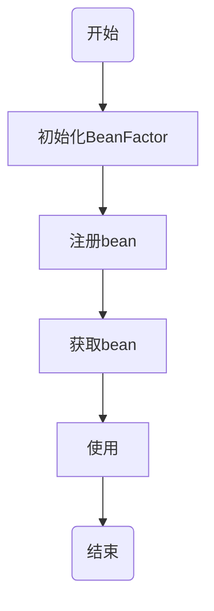
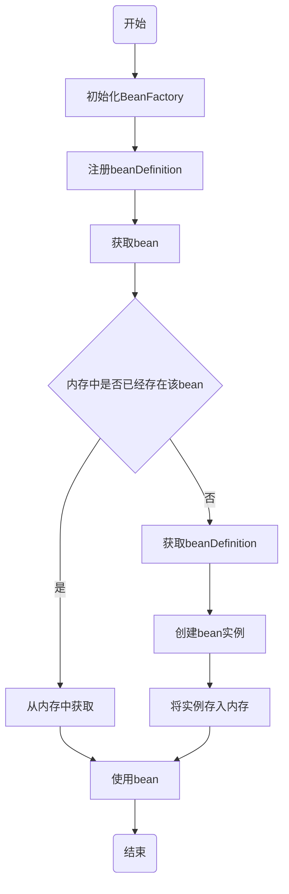
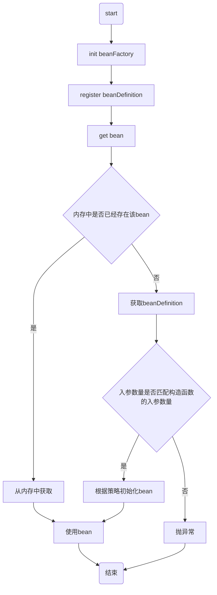

# 《手撸spring》学习笔记

## day1 —— 创建简单的 Bean 容器

### 目标

1. 定义一个简单的Spring容器，用于定义、存放以及获取Bean对象

### Spring Bean容器是什么

1. 凡是可以存放数据的具体数据结构实现，都可以称之为容器。
2. Spring 包含并管理应用对象的配置和生命周期，在这个意义上它是一种用于承载对象的容器
3. 如果一个 Bean 对象交给 Spring 容器管理，那么这个 Bean 对象就应该以类似零件的方式被拆解后存放到 Bean 的定义中，这样相当于一种把对象解耦的操作，可以由 Spring 更加容易的管理，就像处理循环依赖等操作。
4. 当一个 Bean 对象被定义存放以后，再由 Spring 统一进行装配，这个过程包括 Bean 的初始化、属性填充等，最终我们就可以完整的使用一个 Bean 实例化后的对象了。

### 设计思路

1. 在 Spring Bean 容器的场景下，我们需要一种可以用于存放和名称索引式的数据结构，所以选择 HashMap 是最合适不过的。

   原因：

   1. 能让数据更加散列的分布在哈希桶以及碰撞时形成的链表和红黑树上。
   2. 它的数据结构会尽可能最大限度的让整个数据读取的复杂度在 O(1) ~ O(Logn) ~O(n)之间，当然在极端情况下也会有 O(n) 链表查找数据较多的情况。

2. 另外一个简单的 Spring Bean 容器实现，还需 Bean 的定义、注册、获取三个基本步骤，简化设计如下：


* 定义：BeanDefinition；初步实现会加简单的处理，只定义一个 Object 类型用于存放对象。

* 注册：这个过程就相当于我们把数据存放到 HashMap 中，只不过现在 HashMap 存放的是定义了的 Bean 的对象信息。

* 获取：最后就是获取对象，Bean 的名字就是 key，Spring 容器初始化好 Bean 以后，就可以直接获取了。

### 代码（在本地以及PDF中，此处省略）

### 流程图




## day2 —— 实现 Bean 的定义、注册、获取

### 设计逻辑

1. 为了满足系统的扩展性以及便于迭代，需要考虑好系统设计和架构模式
2. 编码方式主要依托于：接口定义、类实现接口、抽象类实现接口、继承类、继承抽象类，而这些操作方式可以很好的隔离开每个类的基础功能、通用功能和业务功能，当类的职责清晰后，你的整个设计也会变得容易扩展和迭代。
3. 本章节继续完善 Spring Bean 容器框架的功能开发，在这个开发过程中会用到较多的接口、类、抽象类，它们之间会有类的实现、类的继承。
4. 虽然并不会很复杂，但这种设计思路是完全可以复用到我们自己的业务系统开发中的。

### 目标

1. 结合已实现的SpringBean容器进行功能完善，实现Bean容器关于Bean对象的注册和获取
2. 考虑单例对象，在第二次获取对象时可以从内存中获取
3. 完善基础容器框架的类结构体，否则将来很难扩容进去其他功能

### 设计

1. 首先非常重要的一点是：在Bean注册时只注册一个类信息，而不会直接把实例化信息注册到Spring容器中。即将BeanDefinition中的属性Object改为Class
2. 获取Bean对象时需要处理Bean对象的实例化操作以及判断当前单例对象在容器中是否以及缓存起来了


1. 首先定义`BeanFactory`这样一个`Bean`工厂，提供`Bean`的获取方法 `getBean(String name)`，之后这个工厂接口由抽象类`AbstractBeanFactory`实现（使用模板模式的设计方式，可以统一收口通用核心方法的调用逻辑和标准定义，也就使得后续实现者不用关心调用逻辑，只需按照统一方式执行；类的继承者只需要关心具体方法的逻辑实现即可）
2. `AbstractAutowireCapableBeanFactory`继承`AbstractBeanFactory`，并实现相应的抽象方法，其他抽象方法由继承该类的其他类实现。*类实现过程中各司其职，你只需要关注属于你的内容，不是你的内容不要参与。*
3. 单例`SingletonBeanRegistry`的接口定时实现，而`DefaultSingletonBeanRegistry`对接口实现后，会被抽象类`AbstractBeanFactory`继承。这样`AbstractBeanFactory` 就是一个非常完整且强大的抽象类了，也能很好地体现出它对模板模式的抽象定义

### 实现过程在代码中，此处略去

### 流程图




### 总结

1. Spring Bean容器的实现类中重点关注类之间的职责和关系，几乎所有的程序功能设计都离不开接口、抽象类、实现、继承，而这些不同特性类的使用就可以非常好地隔离开类的功能职责和作用范围
2. 住代码实现只是最后的落地结果，而那些设计上的思考才是最有价值的地方。

## day3 —— 对象实例化策略

### 技术成长

1. 编程能力的提升更多取决于对复杂场景的架构把控以及对每一个技术实现细节点不断用规模体量的流量冲击验证时，系统是否能保证稳定运行。
2. 在接一个产品需求时，开始思考程序数据结构的设计、核心功能的算法逻辑实现、整体服务的设计模式使用、系统架构的搭建方式、应用集群的部署结构是，就是编程能力真正提高的时候

### 目标

1. 解决bean对象在有参构造函数实例化时埋下的坑（`beanDefinition.getBeanClass().newInstance();`并没有考虑构造函数的入参）

### 设计

#### 技术设计主要考虑两部分：

1. 串流程从哪合理的把构造函数的入参信息传递到实例化操作里
2. 怎么去实例化含有构造函数的对象。

#### 设计


1. 参考Spring Bean容器源码的实现方式，在BeanFactory中添加`Object  getBean(String name, Object... args)`方法，在获取Bean时把构造函数的入参信息传递进去
2. 对于使用什么方式创建含有构造函数的Bean对象这一问题，有两种方法可以选择：
   1. Java本身自带的方法`DeclaredConstructor`
   2. `Cglib`动态地创建Bean对象**（Cglib 是基于字节码框架 ASM 实现，所以你也可以直接通过 ASM 操作指令码来创建对象）**

### 流程图




### 总结

1. 主要完善实例化操作，增加`InstantiationStrategy`实例化策略接口，并有`CglibSubclassingInstanceStrategy`、`SimpleInstantiationStrategy`两个实现类
2. 当代码结构设计的较为合理的时候，就可以容易且方便的进行扩展不同属性的类职责，而不会因为需求的增加导致类结构混乱。所以在我们自己业务需求实现的过程中，也要尽可能的去考虑一个良好的扩展性以及拆分好类的职责。

## day4 —— 注入属性和依赖对象

### 回顾

前几章完成任务：

1. 实现一个容器
2. 定义和注册Bean
3. 实例化 Bean
4. 按照是否包含构造函数实现不同的实例化策略

在对象实例化时还缺少了关于**类中是否有属性的问题**。如果类中有属性，那么在实例化时需要把属性信息填充上，这样才是一个完整的对象创建

### 目标

1. 实例化时需要把属性信息填充上，实现完整的对象创建
2. 除了填充int、Long、String类型外，还包括没有实例化的对象属性，都需要在Bean创建时进行填充操作。
3. 为了学习难度可控，此处暂时不考虑循环依赖，等核心功能实现后，再逐步完善

### 设计

1. 鉴于属性填充是在 Bean 使用 `newInstance` 或者 `Cglib` 创建后，开始补全属性信息，那么就可以在类 `AbstractAutowireCapableBeanFactory` 的`createBean()` 方法中添加补全属性方法。


2. 属性填充要在类实例化创建之后，也就是需要在`AbstractAutowireCapableBeanFactory` 的 `createBean()` 方法中添加`applyPropertyValues()` 操作。

3. 由于我们需要在创建 Bean 时候填充属性操作，那么就需要在 bean 定义BeanDefinition 类中，添加 `PropertyValues` 信息。

4. 另外是填充属性信息还包括了 Bean 的对象类型，也就是需要再定义一个`BeanReference`，里面其实就是一个简单的 Bean 名称，在具体的实例化操作时进

   行递归创建和填充，与 Spring 源码实现一样。**Spring 源码中 BeanReference 是一个接口**

### 代码实现（具体过程在项目中，此处省略）

### 总结

1. 对`AbstractAutowireCapableBeanFactory`类中创建对象的功能又做了扩充，依赖于是否有构造函数的实例化策略完成后，开始补充Bean属性信息。
2. 当遇到 Bean 属性为 Bean 对象时，需要递归处理。最后在属性填充时需要用到反射操作，也可以使用一些工具类处理。
3. 学习编程有的时候学习思路设计要比仅仅是做简单实现，更能提升编程思维。

## day5 —— 资源加载器解析文件注册对象

### 扩展框架

1. 承接功能时需要把以后会发生的事评估到需求里，否则会导致代码的混乱从一开始就埋下，以后会越来越乱
2. 承接需求并能把它做好，这来自于对需求的理解，产品场景开发的经验以及对代码实践落地的把控能力等综合多方面因素的结果。
3. 分清楚代码中哪些是经常变化的，有哪些是固定通用的，有哪些是负责逻辑拼装的、有哪些是来做核心实现的。
4. 如果核心共用层做了频繁变化的业务层包装，那么肯定的说，你的代码即将越来越乱，甚至可能埋下事故的风险
5. 实现的spirng框架中，每一个章节都会结合上一章节继续扩展功能，就像每一次产品都在加需求一样，在学习过程中可以承上启下地对照参考，在自己承接产品需求时加以利用，代码质量会有所提高

### 目标

1. 添加Spring配置的读取、解析、注册Bean的操作
2. 把手动实例化的部分代码通过配置文件的方式创建，简化创建过程

### 设计

1. 们需要在现有的 Spring 框架雏形中添加一个资源解析器，也就是能读取 classpath、本地文件和云文件的配置内容。
2. 配置文件中会包括 Bean 对象的描述和属性信息。
3. 在读取配置文件信息后，接下来就是对配置文件中的Bean 描述信息解析后进行注册操作，把 Bean 对象注册到 Spring 容器中。


* 资源加载器属于相对独立的部分，它位于 Spring 框架核心包下的 IO 实现内容，主要用于处理 Class、本地和云环境中的文件信息。

* 当资源可以加载后，接下来就是解析和注册 Bean 到 Spring 中的操作，这部分实现需要和 DefaultListableBeanFactory 核心类结合起来，因为你所有的解析后的注册动作，都会把 Bean 定义信息放入到这个类中。

* 那么在实现的时候就设计好接口的实现层级关系，包括我们需要定义出 Bean 定义的读取接口 BeanDefinitionReader 以及做好对应的实现类，在实现类中完成对 Bean 对象的解析和注册。

### 代码实现

略

### 总结

1. 以配置文件为入口解析和注册 Bean 信息，最终再通过 Bean 工厂获取 Bean 以及做相应的调用操作。
2. 将资源解析与bean容器区分开，功能互不影响，降低了系统的耦合度

## day6——应用上下文

###  扩展框架

1. 就研发自身来讲，尽可能地要避免临时堆出一个服务来，尤其是团队建设初期或者运营思路经常调整的情况下，更要注重设计细节和实现方案
2. 就本接来讲，如果一个Bean的定义和实例化的过程前后，是否可以满足我们进行自定义扩展，对Bean对象执行一些修改、增强、记录等操作呢？

### 问题

1. 我们不太可能让面向spring本身开发的DefaultListableBeanFactory服务直接给予用户使用


这种方式虽然很好地体现出spring是如何对xml加载以及注册Bean对象的操作过程，但这种方式是面向Spring本身的，不具备一定的扩展性。就像我们现在需要提供出一个可以在Bean初始化过程中，完成对Bean对象的扩展时，就很难做到自动化处理。

### 目标

1. 对容器中Bean的实例化过程添加扩展机制
2. 把目前关于Spring.xml初始化和加载策略进行优化

### 设计

1. 为了满足于在Bean对象从注册到实例化的过程中执行用户的自定义操作，就需要在Bean的定义和初始化过程中插入接口类，这个接口再有外部取实现自己需要的服务。
2. 结合对Spring框架上下文的处理能力，就可以满足我们的目标需求了


1. 满足于对Bean对象扩展的两个接口，其实也是Spring框架中非常重要的两个接口`BeanFactoryPostProcess` 和` BeanPostProcessor`，也几乎是大家在使用Spring框架额外开发自己组建需求的两个必备接口

2. BeanFactoryPostProcessor，是由 Spring 框架组建提供的容器扩展机制，允许在Bean 对象注册后但未实例化之前，对 Bean 的定义信息 BeanDefinition 执

   行修改操作。

3. BeanPostProcessor，也是 Spring 提供的扩展机制，不过 BeanPostProcessor 是在Bean 对象实例化之后修改 Bean 对象，也可以替换 Bean 对象。这部分与后面要实现的 AOP 有着密切的关系。

4. 如果只是添加这两个接口，不做任何包装，那么对于使用者来说还是非常麻烦的。我们希望于开发 Spring 的上下文操作类，把相应的 XML 加载 、注册、实例化以及新增的修改和扩展都融合进去，让 Spring 可以自动扫描到我们的新增服务，便于用户使用。


### 实现


1. 类图中主要体现出来的是关于Spring应用上下文以及对Bean对象扩展机制的实现
2. 以继承了 ListableBeanFactory 接口的 ApplicationContext 接口开始，扩展出一系列应用上下文的抽象实现类，并最终完成ClassPathXmlApplicationContext类的实现。而这个类就是最后交给用户使用的类。
3. 同时在实现应用上下文的过程中，通过定义接口：BeanFactoryPostProcessor、BeanPostProcessor 两个接口，把关于对 Bean 的扩展机制串联进去了。

### 总结

1. 新增了Spring框架中两个非常重要的接口`BeanFactoryPostProcess`、`BeanPostProcessor`
2. 添加了关于应用上下文的实现。ApplicationContext 接口的定义是继承 BeanFactory 外新增加功能的接口，它可以满足于自动识别、资源加载、容器事件、监听器等功能，同时例如一些国际化支持、单例 Bean 自动初始化等，也是可以在这个类里实现和扩充的。
3. 以后做一些关于spring中间件的开发时，如果需要用到Bean对象的获取以及修改一些属性信息就可以使用这两个接口了
4. ` BeanPostProcessor `也是实现 AOP 切面技术的关键所在。
5. 核心技术的原理学习，是更有助于你完成更复杂的架构设计，当你的知识能更全面覆盖所承接的需求时，也就能更好的做出合理的架构和落地。

## day7——初始化和销毁方法

### 易扩展性

1. 从易阅读上来说你的代码要有准确的命名和清晰的注释
2. 从易使用上来说你的代码要具备设计模式的包装让对外的服务调用更简单
3. 从易扩展上来说你的代码要做好业务和功能的实现分层
4. 在易阅读、易使用、易扩展以及更多编码规范的约束下，还需要在开发完成上线后的交付结果上满足高可用、高性能、高并发
5. 定义接口、接口继承接口、接口由抽象类实现、类继承的类实现接口的方法这些操作都是为了让你的程序逻辑做到分层、分区、分块，把核心逻辑层和业务封装层做好隔离， 当业务有变化时，只需要做在业务层完成装配，而底层的核心逻辑服务并不需要频繁变化，它们所增加的接口也更原子化，不具备业务语意。

### 目标

1. 在Bean初始化过程中执行一些操作。比如帮我们做些数据的加载执行，链接注册中心暴漏 RPC 接口以及在 Web 程序关闭时执行链接断开，内存销毁等操作
   1. 需要满足用户可以在xml配置初始化和销毁的方法，也可通过实现类的方式处理

### 设计

1. 对外暴露接口定义使用或者xml配置完成的一系列扩展性操作看似很神秘，其实就是预先执行了一个定义好的接口方法或者时反射调用类中xml中配置的方法，最终你只要按照接口定义实现，就会有Spring容器在处理过程中进行调用而已。整体设计结构如下图：


2. 在`spring.xml` 配置中添加 `init-method`、`destroy-method` 两个注解。
   1. 在配置文件加载的过程中，把注解配置一并定义到 BeanDefinition 的属性当中，这样在initializeBean初始化操作的工程中，就可以通过反射的方式来调用配置在BeanDefinition属性当中的方法信息了。
   2. 另外如果是接口实现的方式，那么直接可以通过 Bean 对象调用对应接口定义的方法即可，((InitializingBean) bean).afterPropertiesSet()
3. 除了在初始化做的操作外，`destroy-method` 和 `DisposableBean` 接口的定义，都会在 Bean 对象初始化完成阶段
4. 执行注册销毁方法的信息到`DefaultSingletonBeanRegistry` 类中的 `disposableBeans` 属性里，这是为了后续统一进行操作。
5. 还有关于适配器的使用，因为反射调用和接口直接调用，是两种方式。所以需要使用适配器进行包装

### 代码实现

1. 因为我们一共实现了两种方式的初始化和销毁方法，xml 配置和定义接口，所以这里既有 `InitializingBean`、`DisposableBean` 也有需要 `XmlBeanDefinitionReader` 加载 `spring.xml` 配置信息到 `BeanDefinition` 中。

2. 另外接口` ConfigurableBeanFactory` 定义了 `destroySingletons` 销毁方法，并由`AbstractBeanFactory` 继承的父类` DefaultSingletonBeanRegistry` 实现`ConfigurableBeanFactory` 接口定义的 `destroySingletons` 方法。

   * 这种方式的设计可能多数程序员是没有用过的，都是谁实现接口谁完成实现类，而不是把实现接口的操作又交给继承的父类处理。
   * 所以这块还是蛮有意思的，是一种不错的隔离分层服务的设计方式
   * 最后就是关于向虚拟机注册钩子，保证在虚拟机关闭之前，执行销毁操作。

3. 在`BeanDefinition`新增了两个属性：`initMethodName`、`destroyMethodName`，方便在spring.xml配置的Bean对象中可以配置
``` xml
initmethod="initDataMethod" destroymethod="destroyDataMethod"
```

### 总结

1. 本文主要完成了关于初始和销毁在使用接口定义
2. 目前这个 Spring 框架对 Bean 的操作越来越完善，可扩展性也不断的增强。
3. 在学习和动手实践 Spring 框架学习的过程中，特别要注意的是它对接口和抽象类的把握和使用，尤其遇到类似，A 继承 B 实现 C 时，C 的接口方法由 A 继承的父类B 实现，这样的操作都蛮有意思的。
