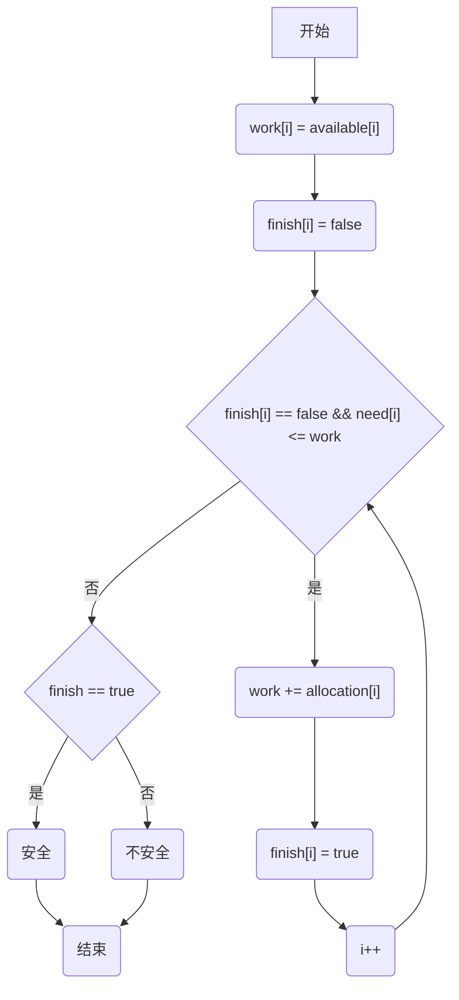

# 银行家算法

## 一、安全序列

在某一时刻，系统中存在某种顺序{P~1~,P~2~,...,P~n~}，使得此时所有进程都能获得其所需的资源，并顺利完成所有进程，则称该系统此时的状态为安全状态，称这样的序列为安全序列

### 安全序列的实质：序列中每一个进程P~i~到运行完成尚需的资源量不超过系统当前剩余资源量与所有在序列中排在它前面的进程所占用的资源量之和

**注意：**

**系统的安全状态可能不唯一 **

**安全状态是非死锁状态，而不安全状态并不一定是死锁状态。即系统处于安全状态一定可以避免死锁，而系统处于不安全状态仅仅可能进入死锁**


## 二、银行家算法

### 实质：

银行家算法的实质是要设法保证系统动态分配资源后，系统依然保证处于安全状态，从而避免死锁。即：系统将判断每个进程请求资源后，系统状态是否依然处于安全状态，如果安全，则给该进程分配资源，否则不予分配，进程将阻塞。

### 前提：

要求进程预先剔除自己的最大资源请求，且假设系统拥有固定的资源总量。

### 银行家算法主要数据结构：

1. 可用资源向量 available——记录系统中各类资源当前可利用数目
2. 最大需求矩阵 max——记录每个进程对各类资源的最大需求量
3. 分配矩阵 allocation——记录每个进程对各类资源当前的占有量
4. 需求矩阵 need——记录每个进程对各类资源仍然需要地数目，等于最大需求矩阵与分配矩阵的差
5. 请求向量 request——记录某个进程对当前各类资源的申请量，是银行家算法的入口参数

### 银行家算法描述如下（设进程P~i~向系统提出request~i~资源请求）

1. 若 request~i~ > need~i~，则进程P~i~出错 

2. 若request~i~ > available~i~， 则进程P~i~阻塞

3. 系统试着把资源分配给进程P~i~，并对相应数据结构作出修改：
```java
available[i] -= request[i]; 
allocation[i] += request[i]; 
need[i] -= request[i];
```

4. 系统执行安全性检测子算法，以判断试分配后系统状态是否安全
5. 若 4 返回为真，则完成本次分配，返回；
6. 否则撤销本次的试分配，进程P~i~阻塞


### 安全检测子算法

银行家算法的核心是在4 步中调用的安全性检测子算法，这个子算法实质上就是个寻找安全序列的过程，如果找到则返回真，表示系统安全，反之表示系统不安全。该子算法用的主要数据结构基于银行家算法，但另外增加了两个向量：

工作向量work与进程可完成标志向量finish。

work记录系统中各类资源的当前可用数目，他是available的替身，以便简化主算法撤销分配的实现。

finish记录进程是否可完成。

#### 子算法执行过程

1. 初始化：work = available；finish = false；
2. 若按进程编号的顺序找到了一个可加入安全序列的进程（finish~i~ = false && need~i~ <= work）P~i~，则假设该进程不久将完成任务归还资源，于是置work = work + allocation~i~ 以及 finish~i~ = true；然后重复执行这一步
3. 若所有进程的finish标志位站，则安全，否则表示不安全

#### 流程图




## 具体实例

假定操作系统中的四个进程P~1~、P~2~、P~3~、P~4~和三类资源R~1~、R~2~、R~3~（资源数量分别为9、3、6），在t~0~时刻的资源分配情况如表所示

<center>t~0~时刻资源分配情况


试问：

1. t~0~时刻是否安全

   解答：可以利用安全检测子算法找到一个安全序列｛P~2~, P~1~, P~3~, P~4~｝因此系统是安全的

2. P~2~发出请求向量request~2~(1, 0, 1)，系统能否将资源分配给它

   解答：

    1. P~2~发出请求向量request~2~(1, 0, 1)，系统按银行家算法检查：

       1. request~2~(1, 0, 1) <= need~2~(1, 0, 2);
       2. request~2~(1, 0, 1) <= available(1, 1, 2);
       3. 系统先假定可以给分配资源，并修改available、allocation~2~、need~2~向量，由此形成的资源变化如下图所示：

       

       4. 再利用安全性检测子算法检查此时系统是否安全：

       

       由安全性检查可得知，存在一个安全序列｛P~2~, P~1~, P~3~, P~4~｝，故系统是安全的，可以将P~2~所申请的资源分配给它。
       

## 代码

```java
import java.util.Arrays;
import java.util.Scanner;

/**
 * @author TanYuan
 * @date 2023/1/5 20:36
 */
public class BankerAlgorithm {
    /**
     * p 进程数
     */
    private static int p;
    /**
     * r 资源种类
     */
    private static int r;
    /**
     * 最大需求矩阵
     * 记录每个进程对各类资源的最大需求量
     */
    private static final int[][] MAX = new int[10][10];
    /**
     * 分配矩阵
     * 记录每个进程对各类资源当前的占有量
     */
    private static final int[][] ALLOCATION = new int[10][10];
    /**
     * 需求矩阵
     * 记录每个进程对各类资源仍然需要地数目，等于最大需求矩阵与分配矩阵的差
     */
    private static final int[][] NEED = new int[10][10];
    /**
     * 可用资源向量
     * 记录系统中各类资源当前可利用数目
     */
    private static final int[] AVAILABLE = new int[10];
    /**
     * 请求向量当前进程对各类资源的申请量,算法的入口参数
     */
    private static final int[] REQUEST = new int[10];

    /**
     * 初始化最大需求矩阵、分配矩阵、需求矩阵以及可用资源向量
     */
    private static void infInput() {
        Scanner scanner = new Scanner(System.in);

        System.out.print("请输入最大需求矩阵max\n");
        for (int i = 0; i < p; i++) {
            String next = scanner.nextLine();
            String[] splitInput = next.split(" ");
            for (int j = 0; j < r; j++) {
                MAX[i][j] = Integer.parseInt(splitInput[j]);
            }
        }

        System.out.print("请输入分配矩阵allocation\n");
        for (int i = 0; i < p; i++) {
            String next = scanner.nextLine();
            String[] splitInput = next.split(" ");
            for (int j = 0; j < r; j++) {
                ALLOCATION[i][j] = Integer.parseInt(splitInput[j]);
            }
        }

        for (int i = 0; i < p; i++) {
            for (int j = 0; j < r; j++) {
                NEED[i][j] = MAX[i][j] - ALLOCATION[i][j];
            }
        }

        System.out.print("请输入可用资源向量available\n");
        String next = scanner.nextLine();
        for(int i = 0; i < r; i++) {
            String[] splitInput = next.split(" ");
            AVAILABLE[i] = Integer.parseInt(splitInput[i]);
        }
    }

    private static boolean compare(int[] m, int[] n) {
        for (int i = 0; i < r; i++) {
            if (m[i] < n[i]) {
                return false;
            }
        }
        return true;
    }

    /**
     * 安全性检测子算法
     * 寻找安全序列，若找到一个安全序列则返回逻辑真值，代表安全。
     * @return true:安全
     */
    private static boolean sTest() {
        int flag = 0;
        // 可完成标志向量，记录该进程是否可加入安全序列
        int[] finish = new int[p];
        // 工作向量，记录各类资源当前可用数目，是available的替身，以便简化撤销操作
        int[] work = new int[r];

        for (int i = 0; i < p; i++) {
            finish[i] = 0;
        }

        System.arraycopy(AVAILABLE, 0, work, 0, r);

        System.out.print("分配序列：\n");
        System.out.print("                 max                      allocation                     need                      available \n");
        for (int k = 0; k < p; k++) {
            for (int i = 0; i < p; i++) {
                if (finish[i] == 1) {
                    continue;
                }
                // 若各类资源当前可用数目小于该进程需求数目代表无法该进程此时无法加入安全序列，若小于则可以加入安全序列中
                if (compare(work, NEED[i])) {
                    // 标志该进程可以完成
                    finish[i] = 1;
                    System.out.print("\n进程" + (i + 1) + "\t");
                    flag = 1;
                    for (int j = 0; j < r; j++) {
                        System.out.print("     " + MAX[i][j]);
                    }
                    System.out.print("          ");
                    for (int j = 0; j < r; j++) {
                        System.out.print("     " + ALLOCATION[i][j]);
                    }
                    System.out.print("          ");
                    for (int j = 0; j < r; j++) {
                        System.out.print("     " + NEED[i][j]);
                    }
                    System.out.print("          ");
                    for (int j = 0; j < r; j++) {
                        work[j] += ALLOCATION[i][j];
                        System.out.print("     " + work[j]);

                    }
                    break;
                }
                if (flag == 1){
                    break;
                }
            }
        }

        System.out.print("\n");
        // 若finish向量全都可以完成，则返回true，有一个无法完成，则返回false
        return Arrays.stream(finish).noneMatch(f -> f == 0);
    }

    /**
     * 如果可用资源都大于请求资源且需求资源都大于请求资源的话，先将请求资源加到该进程的持有资源中，再判别添加后的系统是否能找出一个安全序列
     *
     * @param n 那个进程发起请求
     */
    private static void rTest(int n) {
        if(compare(AVAILABLE, REQUEST) && compare(NEED[n - 1], REQUEST)) {
            // 预先满足进程n所需的资源
            for(int i = 0; i < r; i++) {
                ALLOCATION[n - 1][i] += REQUEST[i];
                NEED[n - 1][i] -= REQUEST[i];
                AVAILABLE[i] -= REQUEST[i];
            }

            if(sTest()){
                System.out.print("允许" + n + "申请资源\n");
            } else {
                System.out.print("不允许" + n + "申请资源\n");
                // 若请求资源的进程获取到资源后无法找到一个安全序列，则需要将申请的资源退回
                for(int i = 0; i < r; i++) {
                    ALLOCATION[n - 1][i] -= REQUEST[i];
                    NEED[n - 1][i] += REQUEST[i];
                    AVAILABLE[i] += REQUEST[i];
                }
            }
        } else {
            System.out.print("申请越界\n");
        }
    }

    public static void main(String[] args) {
        int n;
        Scanner scanner = new Scanner(System.in);
        System.out.print("请输入进程数：\t");
        p = scanner.nextInt();
        System.out.print("请输入资源种类数：\t");
        r = scanner.nextInt();
        infInput();

        if(sTest()) {
            System.out.print("存在安全序列，初始状态安全\n");
        }else {
            System.out.print("不存在安全序列，初始状态不安全\n");
            System.exit(200);
        }
        System.out.print("请输入发出请求向量request的进程编号：");
        n = scanner.nextInt();
        System.out.print("请输入请求向量request\n");
        Scanner input = new Scanner(System.in);
        String next = input.nextLine();
        for(int i = 0; i < r; i++) {
            REQUEST[i] = Integer.parseInt(next.split(" ")[i]);
        }
        rTest(n);
    }
}
```

## 后续

根据银行家算法，引出这样一个公式证明：

 某种系统中有同类互斥资源m个，共n个进程共享使用。若每个进程最多申请x个资源（1 <= x <= m）时，系统不会发生死锁。

证明：因为每个进程最多申请x个资源，所以最坏情况是每个进程都得到了x - 1个资源，并且都在申请最后一个资源。此时系统剩余的资源个数为 m - n * (x - 1)，于是只要系统中至少还存在一个资源可供使用，就可以使者n个进程中某个进程得到其所需的全部资源，使得进程顺利进行下去，并归还占用资源，供其他进程使用。

即满足：
$$
m - n(x - 1) >= 1时；
$$
 ===>
$$
m >= 1 + n(x - 1+)
$$


系统就一定不会死锁。

